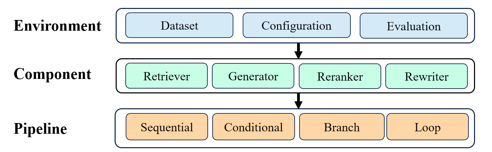

### <div align="center">⚡FlashRAG: A Python Toolkit for Efficient RAG Research<div>


<div align="center">
<a href=""target="_blank">

</a>
<a href="" target="_blank"></a>
<a href="https://github.com/ignorejjj/FlashRAG/blob/main/LICENSE">

</a>
</div>

<h4 align="center">
    <p>
    | <a  href="#installation">Installation</a> |
    <a href="#features">Features</a> |
    <a href="#quick-start">Quick-Start</a> |
    <a href="#⚙️-components"> Components</a> |
    <a href="#🤖-supporting-methods"> Supporting Methods</a> |
    <a href="#🗄️-supporting-datasets"> Supporting Datasets</a> |
    </p>

</h4>

FlashRAG is a Python toolkit for the reproduction and development of Retrieval Augmented Generation (RAG) research. Our toolkit includes 35 pre-processed benchmark RAG datasets and 12 state-of-the-art RAG algorithms. 

<p align="center">

</p>

With FlashRAG and provided resources, you can effortless reproduce existing SOTA works in the RAG domain or implement your custom RAG processes and components.


# ✨ Features

- **🛠 Extensive and Customizable Framework**: Includes essential components for RAG scenarios such as retrievers, rerankers, generators, and compressors, allowing for flexible assembly of complex pipelines.

- **🗂 Comprehensive Benchmark Datasets**: A collection of 35 pre-processed RAG benchmark datasets to test and validate RAG models' performances.

- **🎯 Pre-implemented Advanced RAG Algorithms**: Features 12 advancing RAG algorithms with reported results, based on our framework. Easily reproducing results under different settings.

- **🧩 Efficient Preprocessing Stage**: Simplifies the RAG workflow preparation by providing various scripts like corpus processing for retrieval, retrieval index building, and pre-retrieval of documents.

- **🚀 Optimized Execution**: The library's efficiency is enhanced with tools like vLLM, FastChat for LLM inference acceleration, and Faiss for vector index management.

# 🔧 Installation 

To get started with FlashRAG, simply clone it from Github and install (requires Python 3.9+): 

```bash
git clone https://github.com/ignorejjj/FlashRAG.git
cd FlashRAG
pip install -e . 
```

# 🏃 Quick Start

Run the following code to implement a naive RAG pipeline using provided toy datasets. 
The default retriever is ```e5``` and default generator is ```llama2-7B-chat```. You need to fill in the corresponding model path in the following command. If you wish to use other models, please refer to the detailed instructions below.

```bash
cd examples/quick_start
python simple_pipeline.py \
    --model_path=<LLAMA2-7B-Chat-PATH> \
    --retriever_path=<E5-PATH>
```

After the code is completed, you can view the intermediate results of the run and the final evaluation score in the output folder under the corresponding path.

**Note:** This toy example is just to help test whether the entire process can run normally. Our toy retrieval document only contains 1000 pieces of data, so it may not yield good results.

If you would like to learn more about our toolkit, please refer to our documents.

## ⚙️ Components

In FlashRAG, we have built a series of common RAG components, including retrievers, generators, refiners, and more. Based on these components, we have assembled several pipelines to implement the RAG workflow, while also providing the flexibility to combine these components in custom arrangements to create your own pipeline.

#### RAG-Components

<table>
  <thead>
    <tr>
      <th>Type</th>
      <th>Module</th>
      <th>Description</th>
    </tr>
  </thead>
  <tbody>
    <tr>
      <td rowspan="2">Judger</td>
      <td>SKR Judger</td>
      <td>Judging whether to retrieve using <a href="https://aclanthology.org/2023.findings-emnlp.691.pdf">SKR</a> method</td>
    </tr>
    <tr>
      <td>BM25 Retriever</td>
      <td>Sparse retrieval method based on Lucene</td>
    </tr>
    <tr>
      <td rowspan="3">Retriever</td>
      <td>Dense Retriever</td>
      <td>Bi-encoder models such as dpr, bge, e5, using faiss for search</td>
    </tr>
    <tr>
      <td>Bi-Encoder Reranker</td>
      <td>Calculate matching score using bi-Encoder</td>
    </tr>
    <tr>
      <td>Cross-Encoder Reranker</td>
      <td>Calculate matching score using cross-encoder</td>
    </tr>
    <tr>
      <td rowspan="4">Refiner</td>
      <td>Extractive Refiner</td>
      <td>Refine input by extracting important context</td>
    </tr>
    <tr>
      <td>Abstractive Refiner</td>
      <td>Refine input through seq2seq model</td>
    </tr>
    <tr>
      <td>LLMLingua Refiner</td>
      <td><a href="https://aclanthology.org/2023.emnlp-main.825/">LLMLingua-series</a> prompt compressor</td>
    </tr>
    <tr>
      <td>SelectiveContext Refiner</td>
      <td><a href="https://arxiv.org/abs/2310.06201">Selective-Context</a> prompt compressor</td>
    </tr>
    <tr>
      <td rowspan="4">Generator</td>
      <td>Encoder-Decoder Generator</td>
      <td>Encoder-Decoder model, supporting <a href="https://arxiv.org/abs/2007.01282">Fusion-in-Decoder (FiD)</a></td>
    </tr>
    <tr>
      <td>Decoder-only Generator</td>
      <td>Native transformers implementation</td>
    </tr>
    <tr>
      <td>FastChat Generator</td>
      <td>Accelerate with <a href="https://github.com/lm-sys/FastChat">FastChat</a></td>
    </tr>
    <tr>
      <td>vllm Generator</td>
      <td>Accelerate with <a href="https://github.com/vllm-project/vllm">vllm</a></td>
    </tr>
  </tbody>
</table>

#### Pipelines

Referring to a [survey on retrieval-augmented generation](https://arxiv.org/abs/2312.10997), we categorized RAG methods into four types based on their inference paths.

- **Sequential**: Sequential execuation of RAG process, like Query-(pre-retrieval)-retriever-(post-retrieval)-generator
- **Conditional**: Implements different paths for different types of input queries
- **Branching** : Executes multiple paths in parallel, merging the responses from each path
- **Loop**: Iteratively performs retrieval and generation

In each category, we have implemented corresponding common pipelines. Some pipelines have corresponding work papers.

<table>
    <thead>
        <tr>
            <th>Type</th>
            <th>Module</th>
            <th>Description</th>
        </tr>
    </thead>
    <tbody>
        <tr>
            <td rowspan="1">Sequential</td>
            <td>Sequential Pipeline</td>
            <td>Linear execution of query, supporting refiner, reranker</td>
        </tr>
        <tr>
            <td rowspan="1">Conditional</td>
            <td>Conditional Pipeline</td>
            <td>With a judger module, distinct execution paths for various query types</td>
        </tr>
        <tr>
            <td rowspan="2">Branching</td>
            <td>REPLUG Pipeline</td>
            <td>Generate answer by integrating probabilities in multiple generation paths</td>
        </tr>
          <td>SuRe Pipeline</td>
          <td>Ranking and merging generated results based on each document</td>
        </tr>
        <tr>
            <td rowspan="4">Loop</td>
            <td>Iterative Pipeline</td>
            <td>Alternating retrieval and generation</td>
        </tr>
        <tr>
            <td>Self-Ask Pipeline</td>
            <td>Decompose complex problems into subproblems using <a href="https://arxiv.org/abs/2210.03350">self-ask</a> </td>
        </tr>
        <tr>
            <td>Self-RAG Pipeline</td>
            <td>Adaptive retrieval, critique, and generation</td>
        </tr>
        <tr>
            <td>FLARE Pipeline</td>
            <td>Dynamic retrieval during the generation process</td>
        </tr>
    </tbody>
</table>


## 🤖 Supporting Methods

We have implemented 12 works with a consistent setting of:
- **Generator:** LLAMA3-8B-instruct with input length of 4096
- **Retriever:** e5-base-v2 as embedding model, retrieve 5 docs per query
- **Prompt:** A consistent default prompt, templete can be found in the code.

For open-source methods, we implemented their processes using our framework. For methods where the author did not provide source code, we will try our best to follow the methods in the original paper for implementation.

For necessary settings and hyperparameters specific to some methods, we have documented them in the **specific settings** column. For more details, please consult our code.

It’s important to note that, to ensure consistency, we have utilized a uniform setting. However, this setting may differ from the original setting of the method, leading to variations in results compared to the original outcomes.


| Method               | Type           | NQ (EM) | TriviaQA (EM) | Hotpotqa (F1) | Specific setting                                                                  |
|----------------------|----------------|---------|---------------|---------------|------------------------------------------------------------------------------------|
| Naive Generation     | Sequential     | 22.6    | 55.7          | 28.4          |  |
| Standard RAG         | Sequential     | 35.1    | 58.9          | 35.3          | |
| [AAR-contriever-kilt](https://aclanthology.org/2023.acl-long.136.pdf)  | Sequential     | 30.1    | 56.8          | 33.4          | |
| [LongLLMLingua](https://aclanthology.org/2023.acl-long.136.pdf)        | Sequential     | 32.2    | 59.2          | 37.5          |Compress Ratio=0.5 |
| [RECOMP-abstractive](https://aclanthology.org/2023.acl-long.136.pdf)   | Sequential     | 33.1    | 56.4          | 37.5          | |
| [Selective-Context](https://arxiv.org/abs/2310.06201)    | Sequential     | 30.5    | 55.6          | 34.4          |Compress Ratio=0.5|
| [Ret-Robust](https://arxiv.org/abs/2310.01558)           | Sequential     | 42.9    | 68.2          | 35.8          | Use LLAMA2-13B with trained lora|
| [SuRe](https://arxiv.org/abs/2404.13081)                 | Branching      | 37.1    | 53.2          | 33.4          |Use provided prompt|
| [REPLUG](https://arxiv.org/abs/2404.13081)               | Branching      | 28.9    | 57.7          | 31.2          |  |
| [SKR](https://aclanthology.org/2023.findings-emnlp.691.pdf)                  | Conditional    | 25.5    | 55.9          | 29.8          | Use infernece-time training data|
| [Self-RAG](https://arxiv.org/abs/2310.11511)             | Loop   | 36.4    | 38.2          | 29.6          | Use trained selfrag-llama2-7B|
| [FLARE](https://arxiv.org/abs/2305.06983)                | Loop   | 22.5    | 55.8          | 28.0          | |
| [Iter-Retgen](https://arxiv.org/abs/2305.15294),      [ITRG](https://arxiv.org/abs/2310.05149)   | Loop | 36.8    | 60.1          | 38.3          |  |


## 🗄️ Supporting Datasets

We have collected and processed 35 datasets widely used in RAG research, pre-processing them to ensure a consistent format for ease of use. For certain datasets (such as Wiki-asp), we have adapted them to fit the requirements of RAG tasks according to the methods commonly used within the community. Below is the list of datasets along with the corresponding sample sizes:

| Dataset Name     | Task      | # Train | # Dev| # Test |
|------------------|-----------------|-----------------|---------------|---------------|
| NQ               | QA              | 79168           | 8757          | 3610          |
| TriviaQA         | QA              | 78785           | 8837          | 11313         |
| HotpotQA         | QA              | 90447           | 7405          | /             |
| 2WikiMultiHopQA  | QA              | 15000           | 12576         | /             |
| PopQA            | QA           | /               | /             | 14267         |
| Musique          | QA              | 19938           | 2417          | /             |
| SQuAD            | QA              | 87599           | 10570         | /             |
| MS MARCO         | QA              | 808731          | 101093        | /             |
| MMLU             | Language Understanding          | 99842           | 1531          | 14042         |
| FEVER            | Fact Verification              | 104966          | 10444         | /             |
| TruthfulQA       | QA              | /               | 817           | /             |
| Bamboogle        | QA           | /               | /             | 125           |
| WikiASP          | Open-domain Summarization              | 300636          | 37046         | 37368         |
| NarrativeQA      | QA              | 32747           | 3461          | 10557         |
| WikiQA           | QA              | 20360           | 2733          | 6165          |
| ASQA             | QA              | 4353            | 948           | /             |
| HellaSWAG        | Commonsense Reasoning              | 39905           | 10042         | /             |
| ELI5             | Long-form QA              | 272634          | 1507          | /             |
| WebQuestions     | QA              | 3778            | /             | 2032          |
| AmbigQA          | QA              | 10036           | 2002          | /             |
| SIQA             | Commonsense Reasoning              | 33410           | 1954          | /             |
| T-REx            | Slot Filling              | 2284168         | 5000          | /             |
| ARC-Easy         | Commonsense Reasoning              | 2251            | 570           | 2376          |
| ARC-Challenge    | Commonsense Reasoning              | 1119            | 299           | 1172          |
| WOW              | Dialog Generation              | 63734           | 3054          | /             |
| AIDA CoNll-yago(ay2)              | Entity Linking              | 18395           | 4784          | /             |
| WNED-CWEB        | Entity Linking           | /               | 3396          | /             |
| CommenseQA       | QA              | 9741            | 1221          | /             |
| OpenBookQA       | Commonsense Reasoning             | 4957            | 500           | 500           |
| BoolQ            | QA              | 9427            | 3270          | /             |
| Zero-shot RE(zsre)          | Slot Filling              | 147909          | 3724          | /             |
| CuratedTREC      | QA           | 430             | /             | 430           |
| PIQA             | QA              | 16113           | 1838          | /             |
| FermiReal        | QA              | 185             | 125           | 557           |
| FermiSynth       | QA              | 8000            | 1000          | 1000          |
| WNED-Wiki        | Entity Linking           | /               | 5599          | /             |


## License

FlashRAG is licensed under the [MIT License](./LICENSE).

