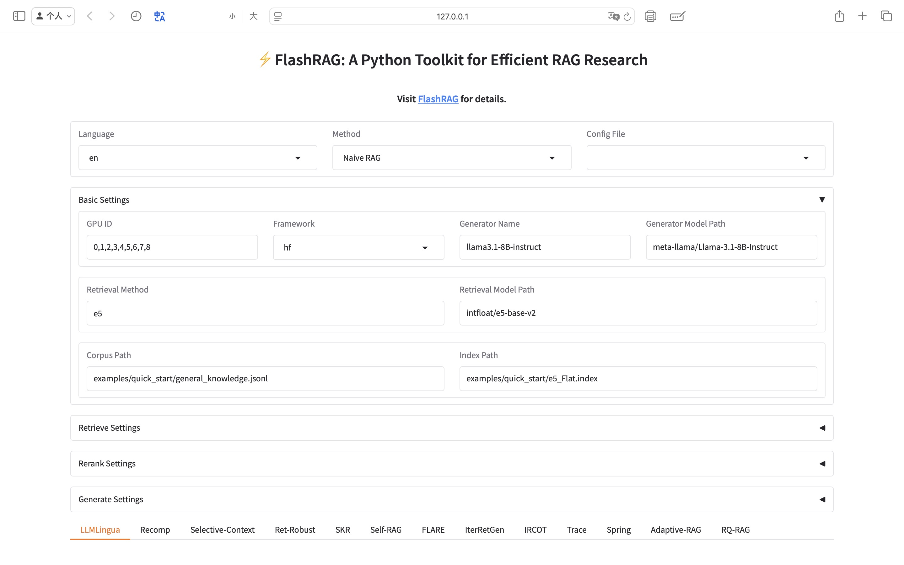

# <div align="center">⚡FlashRAG: A Python Toolkit for Efficient RAG Research<div>
\[ English | [中文](README_zh.md) \]
<div align="center">
<a href="https://arxiv.org/abs/2405.13576" target="_blank"></a>
<a href="https://huggingface.co/datasets/RUC-NLPIR/FlashRAG_datasets/" target="_blank"></a>
<a href="https://www.modelscope.cn/datasets/hhjinjiajie/FlashRAG_Dataset" target="_blank"></a>
<a href="https://github.com/RUC-NLPIR/FlashRAG/blob/main/LICENSE"></a>
<a></a>
</div>

<h4 align="center">

<p>
<a href="#wrench-installation">Installation</a> |
<a href="#sparkles-features">Features</a> |
<a href="#rocket-quick-start">Quick-Start</a> |
<a href="#gear-components"> Components</a> |
<a href="#art-flashrag-ui"> FlashRAG-UI</a> |
<a href="#robot-supporting-methods"> Supporting Methods</a> |
<a href="#notebook-supporting-datasets--document-corpus"> Supporting Datasets</a> |
<a href="#raised_hands-additional-faqs"> FAQs</a>
</p>

</h4>


FlashRAG is a Python toolkit for the reproduction and development of Retrieval Augmented Generation (RAG) research. Our toolkit includes 36 pre-processed benchmark RAG datasets and 17 state-of-the-art RAG algorithms.

<p align="center">

</p>

With FlashRAG and provided resources, you can effortlessly reproduce existing SOTA works in the RAG domain or implement your custom RAG processes and components. Besides, we provide an easy-to-use UI:

https://github.com/user-attachments/assets/8ca00873-5df2-48a7-b853-89e7b18bc6e9

<p>
<a href="https://trendshift.io/repositories/10454" target="_blank"></a>
</p>

## :link: Navigation
- [Features](#sparkles-features)
- [Roadmap](#mag_right-roadmap)
- [Changelog](#page_with_curl-changelog)
- [Installation](#wrench-installation)
- [Quick Start](#rocket-quick-start)
- [Components](#gear-components)
- [FlashRAG-UI](#art-flashrag-ui)
- [Supporting Methods](#robot-supporting-methods)
- [Supporting Datasets & Document Corpus](#notebook-supporting-datasets--document-corpus)
- [Additional FAQs](#raised_hands-additional-faqs)
- [License](#bookmark-license)
- [Citation](#star2-citation)

## :sparkles: Features

- **Extensive and Customizable Framework**: Includes essential components for RAG scenarios such as retrievers, rerankers, generators, and compressors, allowing for flexible assembly of complex pipelines.

- **Comprehensive Benchmark Datasets**: A collection of 36 pre-processed RAG benchmark datasets to test and validate RAG models' performances.

- **Pre-implemented Advanced RAG Algorithms**: Features 17 advancing RAG algorithms with reported results, based on our framework. Easily reproducing results under different settings.

- **Efficient Preprocessing Stage**: Simplifies the RAG workflow preparation by providing various scripts like corpus processing for retrieval, retrieval index building, and pre-retrieval of documents.

- **Optimized Execution**: The library's efficiency is enhanced with tools like vLLM, FastChat for LLM inference acceleration, and Faiss for vector index management.

- **Easy to Use UI** : We have developed a very easy to use UI to easily and quickly configure and experience the RAG baselines we have implemented, as well as run evaluation scripts on a visual interface.

## :mag_right: Roadmap

FlashRAG is still under development and there are many issues and room for improvement. We will continue to update. And we also sincerely welcome contributions on this open-source toolkit.

- [x] Support OpenAI models
- [x] Provdide instructions for each component
- [x] Integrate sentence Transformers
- [x] Support multimodal RAG
- [ ] Inlcude more RAG approaches
- [ ] Add more evaluation metrics (e.g., Unieval, name-entity F1) and benchmarks (e.g., RGB benchmark)
- [ ] Enhance code adaptability and readability
- [ ] Add support for api-based retriever (vllm server)

## :page_with_curl: Changelog
[25/03/21] We have added support for **Reasoning Pipeline**, which is a new paradigm that combines reasoning ability and retrieval, representing work that includes [Search-o1](https://github.com/sunnynexus/Search-o1), [R1-Searcher](https://github.com/SsmallSong/R1-Searcher), [ReSearch](https://github.com/Agent-RL/ReSearch). We evaluate the performance of the pipeline on various RAG benchmarks, it can achieve F1 scores close to 60 on multi hop inference datasets such as Hotpotqe. See it in [**result table**](#robot-supporting-methods).

[25/02/24] 🔥🔥🔥 We have added support for **multimodal RAG**, including [**MLLMs like Llava, Qwen, InternVL**](https://ruc-nlpir.github.io/FlashRAG/#/zh-cn/component/generator?id=%e5%a4%9a%e6%a8%a1%e6%80%81%e7%94%9f%e6%88%90%e5%99%a8), and various [**multimodal retrievers with Clip architecture**](https://ruc-nlpir.github.io/FlashRAG/#/zh-cn/component/retriever?id=%e5%a4%9a%e6%a8%a1%e6%80%81%e6%a3%80%e7%b4%a2%e5%99%a8). More information can be found in our new version of arxiv article and our documentation. Try it!

[25/01/21] Our technical paper [FlashRAG: A Python Toolkit for Efficient RAG Research](https://arxiv.org/abs/2405.13576) is honored to have been accepted to the Resource Track of the 2025 **ACM Web Conference (WWW 2025)**. Please Check it out!

[25/01/12] Introduce <strong>FlashRAG-UI</strong>, an easy to use interface. You can easily and quickly configure and experience the supported RAG methods and evaluate them on the benchmarks.

[25/01/11] We have added support for a new method [<u>RQRAG</u>](https://arxiv.org/abs/2404.00610) method, see it in [**reproduce_experiment**](docs/original_docs/reproduce_experiment.md).

[25/01/07] We have currently support the aggregation of multiple retrievers, see it in [**multi retriever usage**](https://github.com/RUC-NLPIR/FlashRAG/blob/main/docs/original_docs/multi_retriever_usage.md).

[25/01/07] We have integrated a very flexible and lightweight corpus chunking library [**Chunkie**](https://github.com/chonkie-ai/chonkie?tab=readme-ov-file#usage), which supports various custom chunking methods (tokens, sentences, semantic, etc.). Use it in [<u>chunking doc corpus</u>](docs/original_docs/chunk-doc-corpus.md).

[24/10/21] We have released a version based on the Paddle framework that supports Chinese hardware platforms. Please refer to [FlashRAG Paddle](https://github.com/RUC-NLPIR/FlashRAG-Paddle) for details.

[24/10/13] A new in-domain dataset and corpus - [DomainRAG](https://arxiv.org/pdf/2406.05654) have been added to the dataset. The dataset is based on the internal enrollment data of Renmin University of China, covering seven types of tasks, which can be used for conducting domain-specific RAG testing.

[24/09/24] We have released a version based on the MindSpore framework that supports Chinese hardware platforms. Please refer to [FlashRAG MindSpore](https://github.com/RUC-NLPIR/FlashRAG-MindSpore) for details.

<details>
<summary>Show more</summary>

[24/09/18] Due to the complexity and limitations of installing Pyserini in certain environments, we have introduced a lightweight `BM25s` package as an alternative (faster and easier to use). The retriever based on Pyserini will be deprecated in future versions. To use retriever with `bm25s`, just set `bm25_backend` to `bm25s` in config.

[24/09/09] We add support for a new method [<u>Adaptive-RAG</u>](https://aclanthology.org/2024.naacl-long.389.pdf), which can automatically select the RAG process to execute based on the type of query. See it result in [<u>result table</u>](#robot-supporting-methods).

[24/08/02] We add support for a new method [<u>Spring</u>](https://arxiv.org/abs/2405.19670), significantly improve the performance of LLM by adding only a few token embeddings. See it result in [<u>result table</u>](#robot-supporting-methods).

[24/07/17] Due to some unknown issues with HuggingFace, our original dataset link has been invalid. We have updated it. Please check the [new link](https://huggingface.co/datasets/RUC-NLPIR/FlashRAG_datasets/) if you encounter any problems.

[24/07/06] We add support for a new method: [<u>Trace</u>](https://arxiv.org/abs/2406.11460), which refine text by constructing a knowledge graph. See it [<u>results</u>](#robot-supporting-methods) and [<u>details</u>](./docs/original_docs/baseline_details.md).

[24/06/19] We add support for a new method: [<u>IRCoT</u>](https://arxiv.org/abs/2212.10509), and update the [<u>result table</u>](#robot-supporting-methods).

[24/06/15] We provide a [<u>demo</u>](./examples/quick_start/demo_en.py) to perform the RAG process using our toolkit.

[24/06/11] We have integrated `sentence transformers` in the retriever module. Now it's easier to use the retriever without setting pooling methods.

[24/06/05] We have provided detailed document for reproducing existing methods (see [how to reproduce](./docs/original_docs/reproduce_experiment.md), [baseline details](./docs/original_docs/baseline_details.md)), and [<u>configurations settings</u>](./docs/original_docs/configuration.md).

[24/06/02] We have provided an introduction of FlashRAG for beginners, see [<u>an introduction to flashrag</u>](./docs/original_docs/introduction_for_beginners_en.md) ([<u>中文版</u>](./docs/original_docs/introduction_for_beginners_zh.md) [<u>한국어</u>](./docs/original_docs/introduction_for_beginners_kr.md)).

[24/05/31] We supported Openai-series models as generator.

</details>

## :wrench: Installation

To get started with FlashRAG, you can simply install it with pip:

```base
pip install flashrag-dev --pre
```

Or you can clone it from Github and install (requires Python 3.10+):

```bash
git clone https://github.com/RUC-NLPIR/FlashRAG.git
cd FlashRAG
pip install -e .
```

If you want to use vllm, sentence-transformers or pyserini, you can install the optional dependencies:

```bash
# Install all extra dependencies
pip install flashrag-dev[full]

# Install vllm for faster speed
pip install vllm>=0.4.1

# Install sentence-transformers
pip install sentence-transformers

# Install pyserini for bm25
pip install pyserini
```

Due to the incompatibility when installing `faiss` using `pip`, it is necessary to use the following conda command for installation.

```bash
# CPU-only version
conda install -c pytorch faiss-cpu=1.8.0

# GPU(+CPU) version
conda install -c pytorch -c nvidia faiss-gpu=1.8.0
```

Note: It is impossible to install the latest version of `faiss` on certain systems.

From the official Faiss repository ([source](https://github.com/facebookresearch/faiss/blob/main/INSTALL.md)):

> - The CPU-only faiss-cpu conda package is currently available on Linux (x86_64 and arm64), OSX (arm64 only), and Windows (x86_64)
> - faiss-gpu, containing both CPU and GPU indices, is available on Linux (x86_64 only) for CUDA 11.4 and 12.1

## :rocket: Quick Start

### Corpus Construction
To build an index, you first need to save your corpus as a `jsonl` file with each line representing a document.

```jsonl
{"id": "0", "contents": "..."}
{"id": "1", "contents": "..."}
```

If you want to use Wikipedia as your corpus, you can refer to our documentation [Processing Wikipedia](./docs/original_docs/process-wiki.md) to convert it into an indexable format.

### Index Construction

You can use the following code to build your own index.

* For **dense retrieval methods**, especially popular embedding models, we use `faiss` to build the index.

* For **sparse retrieval methods (BM25)**, we use `Pyserini` or `bm25s` to build the corpus into a Lucene inverted index. The built index contains the original documents.

#### For Dense Retrieval Methods

Modify the parameters in the following code to your own.

```bash
python -m flashrag.retriever.index_builder \
  --retrieval_method e5 \
  --model_path /model/e5-base-v2/ \
  --corpus_path indexes/sample_corpus.jsonl \
  --save_dir indexes/ \
  --use_fp16 \
  --max_length 512 \
  --batch_size 256 \
  --pooling_method mean \
  --faiss_type Flat 
```

* ```--pooling_method```: If this parameter is not specified, we will automatically select it based on the model name and model file. However, since different embedding models use different pooling methods, **we may not have fully implemented them**. To ensure accuracy, you can **specify the pooling method corresponding to the retrieval model you are using** (`mean`, `pooler`, or `cls`).

* ```---instruction```: Some embedding models require additional instructions to be concatenated to the query before encoding, which can be specified here. Currently, we will automatically fill in the instructions for **E5** and **BGE** models, while other models need to be supplemented manually.

If the retrieval model supports the `sentence transformers` library, you can use the following code to build the index (**without considering the pooling method**).

```bash
python -m flashrag.retriever.index_builder \
  --retrieval_method e5 \
  --model_path /model/e5-base-v2/ \
  --corpus_path indexes/sample_corpus.jsonl \
  --save_dir indexes/ \
  --use_fp16 \
  --max_length 512 \
  --batch_size 256 \
  --pooling_method mean \
  --sentence_transformer \
  --faiss_type Flat 
```

#### For Sparse Retrieval Methods (BM25)

If building a bm25 index, there is no need to specify `model_path`.

##### Building Index with BM25s

```bash
python -m flashrag.retriever.index_builder \
  --retrieval_method bm25 \
  --corpus_path indexes/sample_corpus.jsonl \
  --bm25_backend bm25s \
  --save_dir indexes/ 
```

##### Building Index with Pyserini

```bash
python -m flashrag.retriever.index_builder \
  --retrieval_method bm25 \
  --corpus_path indexes/sample_corpus.jsonl \
  --bm25_backend pyserini \
  --save_dir indexes/ 
```

### Using the ready-made pipeline

You can use the pipeline class we have already built (as shown in [<u>pipelines</u>](#pipelines)) to implement the RAG process inside. In this case, you just need to configure the config and load the corresponding pipeline.

Firstly, load the entire process's config, which records various hyperparameters required in the RAG process. You can input yaml files as parameters or directly as variables.

Please note that **variables as input take precedence over files**.

```python
from flashrag.config import Config

# hybrid load configs
config_dict = {'data_dir': 'dataset/'}
my_config = Config(
    config_file_path = 'my_config.yaml',
    config_dict = config_dict
```

We provide comprehensive guidance on how to set configurations, you can see our [<u>configuration guidance</u>](./docs/original_docs/configuration.md).
You can also refer to the [<u>basic yaml file</u>](./flashrag/config/basic_config.yaml) we provide to set your own parameters.

Next, load the corresponding dataset and initialize the pipeline. The components in the pipeline will be automatically loaded.

```python
from flashrag.utils import get_dataset
from flashrag.pipeline import SequentialPipeline
from flashrag.prompt import PromptTemplate
from flashrag.config import Config

config_dict = {'data_dir': 'dataset/'}
my_config = Config(
    config_file_path = 'my_config.yaml',
    config_dict = config_dict
)
all_split = get_dataset(my_config)
test_data = all_split['test']

pipeline = SequentialPipeline(my_config)
```

You can specify your own input prompt using `PromptTemplete`:

```python
prompt_templete = PromptTemplate(
    config,
    system_prompt = "Answer the question based on the given document. Only give me the answer and do not output any other words.\nThe following are given documents.\n\n{reference}",
    user_prompt = "Question: {question}\nAnswer:"
)
pipeline = SequentialPipeline(
  my_config,
  prompt_template = prompt_templete
)
```

Finally, execute `pipeline.run` to obtain the final result.

```python
output_dataset = pipeline.run(test_data, do_eval=True)
```

The `output_dataset` contains the intermediate results and metric scores for each item in the input dataset.
Meanwhile, the dataset with intermediate results and the overall evaluation score will also be saved as a file (if `save_intermediate_data` and `save_metric_score` are specified).

### Build your own pipeline!

Sometimes you may need to implement more complex RAG process, and you can build your own pipeline to implement it.
You just need to inherit `BasicPipeline`, initialize the components you need, and complete the `run` function.

```python
from flashrag.pipeline import BasicPipeline
from flashrag.utils import get_retriever, get_generator

class ToyPipeline(BasicPipeline):
  def __init__(self, config, prompt_templete=None):
    # Load your own components
    pass

  def run(self, dataset, do_eval=True):
    # Complete your own process logic

    # get attribute in dataset using `.`
    input_query = dataset.question
    ...
    # use `update_output` to save intermeidate data
    dataset.update_output("pred",pred_answer_list)
    dataset = self.evaluate(dataset, do_eval=do_eval)
    return dataset
```

Please first understand the input and output forms of the components you need to use from our [<u>documentation</u>](./docs/original_docs/basic_usage.md).

### Just use components

If you already have your own code and only want to use our components to embed the original code, you can refer to the [<u>basic introduction of the components</u>](./docs/original_docs/basic_usage.md) to obtain the input and output formats of each component.

## :gear: Components

In FlashRAG, we have built a series of common RAG components, including retrievers, generators, refiners, and more. Based on these components, we have assembled several pipelines to implement the RAG workflow, while also providing the flexibility to combine these components in custom arrangements to create your own pipeline.

#### RAG-Components

<table>
  <thead>
    <tr>
      <th>Type</th>
      <th>Module</th>
      <th>Description</th>
    </tr>
  </thead>
  <tbody>
    <tr>
      <td rowspan="1">Judger</td>
      <td>SKR Judger</td>
      <td>Judging whether to retrieve using <a href="https://aclanthology.org/2023.findings-emnlp.691.pdf">SKR</a> method</td>
    </tr>
    <tr>
      <td rowspan="4">Retriever</td>
      <td>Dense Retriever</td>
      <td>Bi-encoder models such as dpr, bge, e5, using faiss for search</td>
    </tr>
    <tr>
      <td>BM25 Retriever</td>
      <td>Sparse retrieval method based on Lucene</td>
    </tr>
    <tr>
      <td>Bi-Encoder Reranker</td>
      <td>Calculate matching score using bi-Encoder</td>
    </tr>
    <tr>
      <td>Cross-Encoder Reranker</td>
      <td>Calculate matching score using cross-encoder</td>
    </tr>
    <tr>
      <td rowspan="5">Refiner</td>
      <td>Extractive Refiner</td>
      <td>Refine input by extracting important context</td>
    </tr>
    <tr>
      <td>Abstractive Refiner</td>
      <td>Refine input through seq2seq model</td>
    </tr>
    <tr>
      <td>LLMLingua Refiner</td>
      <td><a href="https://aclanthology.org/2023.emnlp-main.825/">LLMLingua-series</a> prompt compressor</td>
    </tr>
    <tr>
      <td>SelectiveContext Refiner</td>
      <td><a href="https://arxiv.org/abs/2310.06201">Selective-Context</a> prompt compressor</td>
    </tr>
    <tr>
      <td> KG Refiner </td>
      <td>Use <a hred='https://arxiv.org/abs/2406.11460'>Trace method to construct a knowledge graph</td>
    <tr>
      <td rowspan="4">Generator</td>
      <td>Encoder-Decoder Generator</td>
      <td>Encoder-Decoder model, supporting <a href="https://arxiv.org/abs/2007.01282">Fusion-in-Decoder (FiD)</a></td>
    </tr>
    <tr>
      <td>Decoder-only Generator</td>
      <td>Native transformers implementation</td>
    </tr>
    <tr>
      <td>FastChat Generator</td>
      <td>Accelerate with <a href="https://github.com/lm-sys/FastChat">FastChat</a></td>
    </tr>
    <tr>
      <td>vllm Generator</td>
      <td>Accelerate with <a href="https://github.com/vllm-project/vllm">vllm</a></td>
    </tr>
  </tbody>
</table>

#### Pipelines

Referring to a [<u>survey on retrieval-augmented generation</u>](https://arxiv.org/abs/2312.10997), we categorized RAG methods into four types based on their inference paths.

- **Sequential**: Sequential execuation of RAG process, like Query-(pre-retrieval)-retriever-(post-retrieval)-generator
- **Conditional**: Implements different paths for different types of input queries
- **Branching** : Executes multiple paths in parallel, merging the responses from each path
- **Loop**: Iteratively performs retrieval and generation

In each category, we have implemented corresponding common pipelines. Some pipelines have corresponding work papers.

<table>
    <thead>
        <tr>
            <th>Type</th>
            <th>Module</th>
            <th>Description</th>
        </tr>
    </thead>
    <tbody>
        <tr>
            <td rowspan="1">Sequential</td>
            <td>Sequential Pipeline</td>
            <td>Linear execution of query, supporting refiner, reranker</td>
        </tr>
        <tr>
            <td rowspan="1">Conditional</td>
            <td>Conditional Pipeline</td>
            <td>With a judger module, distinct execution paths for various query types</td>
        </tr>
        <tr>
            <td rowspan="2">Branching</td>
            <td>REPLUG Pipeline</td>
            <td>Generate answer by integrating probabilities in multiple generation paths</td>
        </tr>
          <td>SuRe Pipeline</td>
          <td>Ranking and merging generated results based on each document</td>
        </tr>
        <tr>
            <td rowspan="6">Loop</td>
            <td>Iterative Pipeline</td>
            <td>Alternating retrieval and generation</td>
        </tr>
        <tr>
            <td>Self-Ask Pipeline</td>
            <td>Decompose complex problems into subproblems using <a href="https://arxiv.org/abs/2210.03350">self-ask</a> </td>
        </tr>
        <tr>
            <td>Self-RAG Pipeline</td>
            <td>Adaptive retrieval, critique, and generation</td>
        </tr>
        <tr>
            <td>FLARE Pipeline</td>
            <td>Dynamic retrieval during the generation process</td>
        </tr>
        <tr>
            <td>IRCoT Pipeline</td>
            <td>Integrate retrieval process with CoT</td>
        </tr>
        <tr>
            <td>Reasoning Pipeline</td>
            <td>Reasoning with retrieval</td>
        </tr>
    </tbody>
</table>

## :art: FlashRAG-UI
<p>With <strong>FlashRAG-UI</strong>, you can easily and quickly configure and experience the supported RAG methods through our meticulously designed visual interface, and evaluate these methods on benchmarks, making complex research work more efficient!</p>

### :star2: Features
- **One-Click Configuration Loading**
  - You can load parameters and configuration files for various RAG methods through simple clicks, selections, and inputs.</li>
  - Supports preview interface for intuitive parameter settings.</li>
  - Provides save functionality to easily store configurations for future use.</li>
- **Quick Method Experience**
  - Quickly load corpora and index files to explore the characteristics and application scenarios of various RAG methods.</li>
  - Supports loading and switching different components and hyperparameters, seamlessly connecting different RAG Pipelines to quickly experience their performance and differences!</li>
- **Efficient Benchmark Reproduction**
  - Easily reproduce the built-in baseline methods and carefully collected benchmarks on FlashRAG-UI.</li>
  - Use cutting-edge research tools directly without complex settings, providing a smooth experience for your research work!</li>
  
<details>
<summary>Show more</summary>
<table align="center">
  <tr>
    <td align="center">
      
    </td>
    <td align="center">
      
    </td>
  </tr>
  <tr>
    <td align="center">
      
    </td>
    <td align="center">
      
    </td>
  </tr>
</table>
</details>

#### Experience our meticulously designed FlashRAG-UI—both user-friendly and visually appealing:
```bash
cd webui
python interface.py
```

## :robot: Supporting Methods

We have implemented 15 works with a consistent setting of:

- **Generator:** LLAMA3-8B-instruct with input length of 2048
- **Retriever:** e5-base-v2 as embedding model, retrieve 5 docs per query
- **Prompt:** A consistent default prompt, template can be found in the [<u>method details</u>](./docs/original_docs/baseline_details.md).

For open-source methods, we implemented their processes using our framework. For methods where the author did not provide source code, we will try our best to follow the methods in the original paper for implementation.

For necessary settings and hyperparameters specific to some methods, we have documented them in the **specific settings** column. For more details, please consult our [<u>reproduce guidance</u>](./docs/original_docs/reproduce_experiment.md) and [<u>method details</u>](./docs/original_docs/baseline_details.md).

It’s important to note that, to ensure consistency, we have utilized a uniform setting. However, this setting may differ from the original setting of the method, leading to variations in results compared to the original outcomes.

| Method                                                                                    | Type        | NQ (EM) | TriviaQA (EM) | Hotpotqa (F1) | 2Wiki (F1) | PopQA (F1) | WebQA(EM) | Specific setting                                |
| ----------------------------------------------------------------------------------------- | ----------- | ------- | ------------- | ------------- | ---------- | ---------- | --------- | ----------------------------------------------- |
| Naive Generation                                                                          | Sequential  | 22.6    | 55.7          | 28.4          | 33.9       | 21.7       | 18.8      |                                                 |
| Standard RAG                                                                              | Sequential  | 35.1    | 58.9          | 35.3          | 21.0       | 36.7       | 15.7      |                                                 |
| [AAR-contriever-kilt](https://aclanthology.org/2023.acl-long.136.pdf)                     | Sequential  | 30.1    | 56.8          | 33.4          | 19.8       | 36.1       | 16.1      |                                                 |
| [LongLLMLingua](https://arxiv.org/abs/2310.06839)                                         | Sequential  | 32.2    | 59.2          | 37.5          | 25.0       | 38.7       | 17.5      | Compress Ratio=0.5                              |
| [RECOMP-abstractive](https://arxiv.org/pdf/2310.04408)                                    | Sequential  | 33.1    | 56.4          | 37.5          | 32.4       | 39.9       | 20.2      |                                                 |
| [Selective-Context](https://arxiv.org/abs/2310.06201)                                     | Sequential  | 30.5    | 55.6          | 34.4          | 18.5       | 33.5       | 17.3      | Compress Ratio=0.5                              |
| [Trace](https://arxiv.org/abs/2406.11460)                                                 | Sequential  | 30.7    | 50.2          | 34.0          | 15.5       | 37.4       | 19.9      |                                                 |
| [Spring](https://arxiv.org/abs/2405.19670)                                                | Sequential  | 37.9    | 64.6          | 42.6          | 37.3       | 54.8       | 27.7      | Use Llama2-7B-chat with trained embedding table |
| [SuRe](https://arxiv.org/abs/2404.13081)                                                  | Branching   | 37.1    | 53.2          | 33.4          | 20.6       | 48.1       | 24.2      | Use provided prompt                             |
| [REPLUG](https://arxiv.org/abs/2301.12652)                                                | Branching   | 28.9    | 57.7          | 31.2          | 21.1       | 27.8       | 20.2      |                                                 |
| [SKR](https://aclanthology.org/2023.findings-emnlp.691.pdf)                               | Conditional | 33.2    | 56.0          | 32.4          | 23.4       | 31.7       | 17.0      | Use infernece-time training data                |
| [Adaptive-RAG](https://aclanthology.org/2024.naacl-long.389.pdf)                          | Conditional | 35.1    | 56.6          | 39.1          | 28.4       | 40.4       | 16.0      |                                                 |
| [Ret-Robust](https://arxiv.org/abs/2310.01558)                                            | Loop        | 42.9    | 68.2          | 35.8          | 43.4       | 57.2       | 33.7      | Use LLAMA2-13B with trained lora                |
| [Self-RAG](https://arxiv.org/abs/2310.11511)                                              | Loop        | 36.4    | 38.2          | 29.6          | 25.1       | 32.7       | 21.9      | Use trained selfrag-llama2-7B                   |
| [FLARE](https://arxiv.org/abs/2305.06983)                                                 | Loop        | 22.5    | 55.8          | 28.0          | 33.9       | 20.7       | 20.2      |                                                 |
| [Iter-Retgen](https://arxiv.org/abs/2305.15294), [ITRG](https://arxiv.org/abs/2310.05149) | Loop        | 36.8    | 60.1          | 38.3          | 21.6       | 37.9       | 18.2      |                                                 |
| [IRCoT](https://aclanthology.org/2023.acl-long.557.pdf)                                   | Loop        | 33.3    | 56.9          | 41.5          | 32.4       | 45.6       | 20.7      |                                                 |
| [RQRAG](https://arxiv.org/abs/2404.00610)                                   | Loop        | 32.6    | 52.5          | 33.5          | 35.8       | 46.4       | 26.2      |  Use trained rqrag-llama2-7B                                               |
| [R1-Searcher](https://arxiv.org/pdf/2503.05592) | Reasoning | 37.3 | 58.7 | 59.5 | 55.5 | 43.9 | 27.5 | Using trained Qwen2.5-7B model |
 


## :notebook: Supporting Datasets & Document Corpus

### Datasets

We have collected and processed 36 datasets widely used in RAG research, pre-processing them to ensure a consistent format for ease of use. For certain datasets (such as Wiki-asp), we have adapted them to fit the requirements of RAG tasks according to the methods commonly used within the community. All datasets are available at [<u>Huggingface datasets</u>](https://huggingface.co/datasets/RUC-NLPIR/FlashRAG_datasets).

For each dataset, we save each split as a `jsonl` file, and each line is a dict as follows:

```python
{
  'id': str,
  'question': str,
  'golden_answers': List[str],
  'metadata': dict
}
```

Below is the list of datasets along with the corresponding sample sizes:

| Task                      | Dataset Name    | Knowledge Source | # Train   | # Dev   | # Test |
| ------------------------- | --------------- | ---------------- | --------- | ------- | ------ |
| QA                        | NQ              | wiki             | 79,168    | 8,757   | 3,610  |
| QA                        | TriviaQA        | wiki & web       | 78,785    | 8,837   | 11,313 |
| QA                        | PopQA           | wiki             | /         | /       | 14,267 |
| QA                        | SQuAD           | wiki             | 87,599    | 10,570  | /      |
| QA                        | MSMARCO-QA      | web              | 808,731   | 101,093 | /      |
| QA                        | NarrativeQA     | books and story  | 32,747    | 3,461   | 10,557 |
| QA                        | WikiQA          | wiki             | 20,360    | 2,733   | 6,165  |
| QA                        | WebQuestions    | Google Freebase  | 3,778     | /       | 2,032  |
| QA                        | AmbigQA         | wiki             | 10,036    | 2,002   | /      |
| QA                        | SIQA            | -                | 33,410    | 1,954   | /      |
| QA                        | CommonSenseQA   | -                | 9,741     | 1,221   | /      |
| QA                        | BoolQ           | wiki             | 9,427     | 3,270   | /      |
| QA                        | PIQA            | -                | 16,113    | 1,838   | /      |
| QA                        | Fermi           | wiki             | 8,000     | 1,000   | 1,000  |
| multi-hop QA              | HotpotQA        | wiki             | 90,447    | 7,405   | /      |
| multi-hop QA              | 2WikiMultiHopQA | wiki             | 15,000    | 12,576  | /      |
| multi-hop QA              | Musique         | wiki             | 19,938    | 2,417   | /      |
| multi-hop QA              | Bamboogle       | wiki             | /         | /       | 125    |
| multi-hop QA              | StrategyQA      | wiki             | 2290      | /       | /      |
| Long-form QA              | ASQA            | wiki             | 4,353     | 948     | /      |
| Long-form QA              | ELI5            | Reddit           | 272,634   | 1,507   | /      |
| Long-form QA              | WikiPassageQA   | wiki             | 3,332     | 417     | 416    |
| Open-Domain Summarization | WikiASP         | wiki             | 300,636   | 37,046  | 37,368 |
| multiple-choice           | MMLU            | -                | 99,842    | 1,531   | 14,042 |
| multiple-choice           | TruthfulQA      | wiki             | /         | 817     | /      |
| multiple-choice           | HellaSWAG       | ActivityNet      | 39,905    | 10,042  | /      |
| multiple-choice           | ARC             | -                | 3,370     | 869     | 3,548  |
| multiple-choice           | OpenBookQA      | -                | 4,957     | 500     | 500    |
| multiple-choice           | QuaRTz          | -                | 2696      | 384     | 784    |
| Fact Verification         | FEVER           | wiki             | 104,966   | 10,444  | /      |
| Dialog Generation         | WOW             | wiki             | 63,734    | 3,054   | /      |
| Entity Linking            | AIDA CoNll-yago | Freebase & wiki  | 18,395    | 4,784   | /      |
| Entity Linking            | WNED            | Wiki             | /         | 8,995   | /      |
| Slot Filling              | T-REx           | DBPedia          | 2,284,168 | 5,000   | /      |
| Slot Filling              | Zero-shot RE    | wiki             | 147,909   | 3,724   | /      |
| In-domain QA              | DomainRAG       | Web pages of RUC | /         | /       | 485    |

### Document Corpus

Our toolkit supports jsonl format for retrieval document collections, with the following structure:

```jsonl
{"id":"0", "contents": "..."}
{"id":"1", "contents": "..."}
```

The `contents` key is essential for building the index. For documents that include both text and title, we recommend setting the value of `contents` to `{title}\n{text}`. The corpus file can also contain other keys to record additional characteristics of the documents.

In the academic research, Wikipedia and MS MARCO are the most commonly used retrieval document collections. For Wikipedia, we provide a [<u>comprehensive script</u>](./docs/original_docs/process-wiki.md) to process any Wikipedia dump into a clean corpus. Additionally, various processed versions of the Wikipedia corpus are available in many works, and we have listed some reference links.

For MS MARCO, it is already processed upon release and can be directly downloaded from its [<u>hosting link</u>](https://huggingface.co/datasets/Tevatron/msmarco-passage-corpus) on Hugging Face.

### Index

To facilitate easier replication of the experiments, we now provide a preprocessed index available in the ModelScope dataset page: [FlashRAG_Dataset/retrieval_corpus/wiki18_100w_e5_index.zip](https://www.modelscope.cn/datasets/hhjinjiajie/FlashRAG_Dataset/file/view/master?id=47985&status=2&fileName=retrieval_corpus%252Fwiki18_100w_e5_index.zip).

The index was created using the e5-base-v2 retriever on our uploaded wiki18_100w dataset, which is consistent with the index used in our experiments.

## :lollipop: Awesome Work using FlashRAG

- [R1-Searcher](https://github.com/SsmallSong/R1-Searcher), a method that incentivizes the search capability in LLMs via reinforcement learning
- [ReSearch](https://github.com/Agent-RL/ReSearch), a method that learns to reason with search for LLMs via reinforcement learning
- [AutoCoA](https://github.com/ADaM-BJTU/AutoCoA), a method that internalizes chain-of-action generation into reasoning models

## :raised_hands: Additional FAQs

- [How should I set different experimental parameters?](./docs/original_docs/configuration.md)
- [How to build my own corpus, such as a specific segmented Wikipedia?](./docs/original_docs/process-wiki.md)
- [How to index my own corpus?](./docs/original_docs/building-index.md)
- [How to reproduce supporting methods?](./docs/original_docs/reproduce_experiment.md)

## :bookmark: License

FlashRAG is licensed under the [<u>MIT License</u>](./LICENSE).

## :star2: Citation

Please kindly cite our paper if helps your research:

```BibTex
@article{FlashRAG,
  author       = {Jiajie Jin and
                  Yutao Zhu and
                  Xinyu Yang and
                  Chenghao Zhang and
                  Zhicheng Dou},
  title        = {FlashRAG: {A} Modular Toolkit for Efficient Retrieval-Augmented Generation
                  Research},
  journal      = {CoRR},
  volume       = {abs/2405.13576},
  year         = {2024},
  url          = {https://doi.org/10.48550/arXiv.2405.13576},
  doi          = {10.48550/ARXIV.2405.13576},
  eprinttype    = {arXiv},
  eprint       = {2405.13576},
  timestamp    = {Tue, 18 Jun 2024 09:26:37 +0200},
  biburl       = {https://dblp.org/rec/journals/corr/abs-2405-13576.bib},
  bibsource    = {dblp computer science bibliography, https://dblp.org}
}
```

## Star History

[](https://star-history.com/#RUC-NLPIR/FlashRAG&Date)
