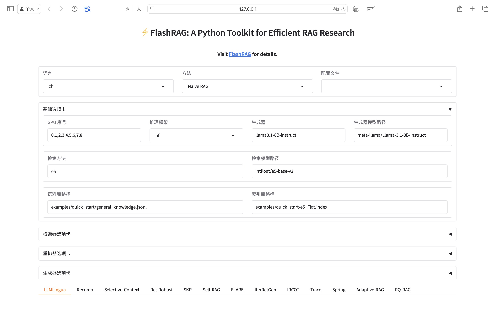
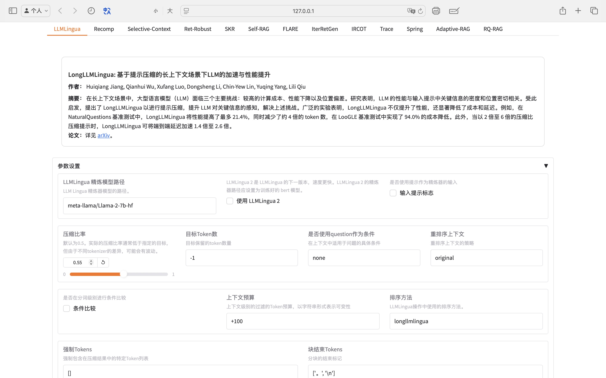
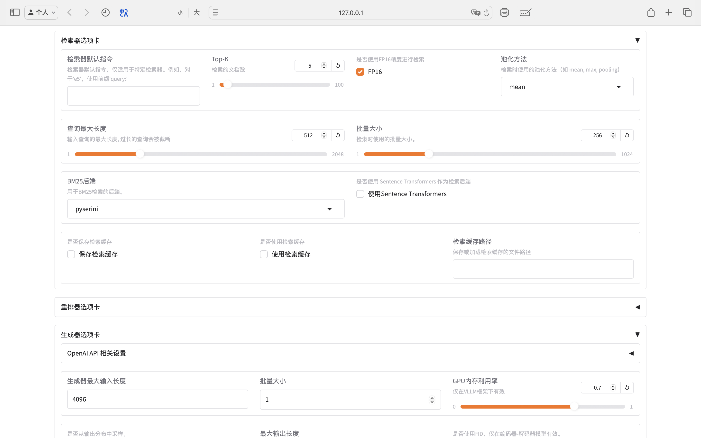
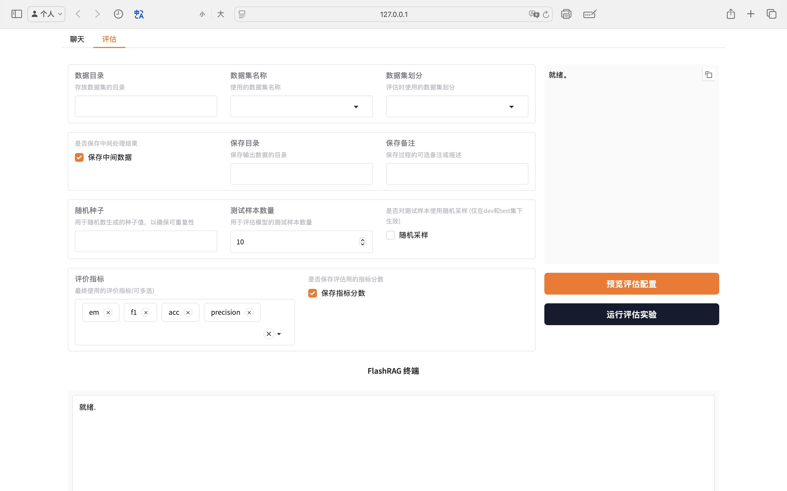

# <div align="center">⚡FlashRAG: 一个高效的RAG研究Python工具包<div>
\[ [English](README.md) | 中文 \]
<div align="center">
<a href="https://arxiv.org/abs/2405.13576" target="_blank"></a>
<a href="https://huggingface.co/datasets/RUC-NLPIR/FlashRAG_datasets/" target="_blank"></a>
<a href="https://www.modelscope.cn/datasets/hhjinjiajie/FlashRAG_Dataset" target="_blank"></a>
<a href="https://github.com/RUC-NLPIR/FlashRAG/blob/main/LICENSE"></a>
<a></a>
</div>

<h4 align="center">
<p>
<a href="#wrench-安装">安装</a> |
<a href="#sparkles-特性">特性</a> |
<a href="#rocket-快速开始">快速开始</a> |
<a href="#gear-组件">组件</a> |
<a href="#art-flashrag-ui">FlashRAG-UI</a> |
<a href="#robot-基线方法">支持的基线方法</a> |
<a href="#notebook-支持的数据集和文档语料库">支持的数据集</a> |
<a href="#raised_hands-其他常见问题">常见问题</a>
</p>
</h4>

FlashRAG是一个用于复现和开发检索增强生成（RAG）研究的Python工具包。我们的工具包包括36个预处理的基准RAG数据集和17个最先进的RAG算法。

<p align="center">

</p>

通过FlashRAG和提供的资源，您可以轻松复现现有的SOTA工作，或实现自定义的RAG流程和组件。我们也提供了一个简介易用的可视化界面：

https://github.com/user-attachments/assets/e34a90c0-5e0f-4f76-886e-e30de8a6f8d1

<p>
<a href="https://trendshift.io/repositories/10454" target="_blank"></a>
</p>

## :link: 导航
- [特性](#sparkles-特性)
- [开发路线图](#mag_right-开发路线图)
- [更新日志](#page_with_curl-更新日志)
- [安装](#wrench-安装)
- [快速开始](#rocket-快速开始)
- [组件](#gear-组件)
- [FlashRAG-UI](#art-flashrag-ui)
- [基线方法](#robot-基线方法)
- [支持的数据集和文档语料库](#notebook-支持的数据集和文档语料库)
- [其他常见问题](#raised_hands-其他常见问题)
- [许可证](#bookmark-许可证)
- [引用](#star2-引用)

## :sparkles: 特性

- **广泛且可定制的框架**：包括RAG场景的基本组件，如检索器、重排序器、生成器和压缩器，允许灵活组装复杂的管道。

- **全面的基准数据集**：收集了36个预处理的RAG基准数据集，用于测试和验证RAG模型的性能。

- **预实现的先进RAG算法**：基于我们的框架，提供17个先进的RAG算法及其报告结果。轻松在不同设置下复现结果。

- **高效的预处理过程**：通过提供各种脚本，如**语料处理**、**索引构建**和**文档预检索**，简化RAG工作流准备。

- **优化的执行效率**：库的效率通过vLLM、FastChat用于LLM推理加速和Faiss用于向量索引管理得到增强。

- **方便易用的UI界面**：我们开发了一个十分方便易用的UI界面，以供轻松、快捷地配置和体验我们已经实现的RAG方法，以及在可视化界面上运行评估脚本。

## :mag_right: 开发路线图

FlashRAG仍在开发中，存在许多问题和改进空间。我们将继续更新，并诚挚欢迎对这个开源工具包的贡献。

- [x] 支持OpenAI模型
- [x] 提供每个组件的使用说明
- [x] 集成sentence-transformers
- [ ] 包含更多RAG方法
- [ ] 添加更多评估指标（如Unieval、命名实体F1）和基准（如RGB基准）
- [ ] 增强代码的适应性和可读性

## :page_with_curl: 更新日志
[25/03/21] 我们新增了对**推理流程**的支持，这是一种结合推理能力和检索的新范式，代表工作包括[Search-o1](https://github.com/sunnynexus/Search-o1)、[R1-Searcher](https://github.com/SsmallSong/R1-Searcher)、[ReSearch](https://github.com/Agent-RL/ReSearch)。我们在各种RAG基准上评估了流程的性能，在多跳推理数据集（如Hotpotqe）上可以达到接近60的F1分数。详见[**结果表**](#robot-supporting-methods)。


[25/02/24] 我们新增了对多模态RAG的支持，包括Llava、Qwen、InternVL等MLLM，以及基于Clip结构的各类检索器。

[25/01/21] 我们的论文 FlashRAG: A Python Toolkit for Efficient RAG Research 已经被 **Resource Track of the 2025 ACM Web Conference (WWW 2025)** 接收! 

[25/01/12] 介绍 <strong>FlashRAG-UI</strong>，一个易于使用的界面。您可以通过它轻松快捷地配置和体验支持的RAG方法，并在基准上评估这些方法。

[25/01/11] 我们添加了对新方法[<u>RQRAG</u>](https://arxiv.org/abs/2404.00610)方法的支持，详见[**复现实验**](docs/reproduce_experiment_zh.md)。

[25/01/07] 我们目前支持多个检索器的聚合，详见[**多检索器使用**](https://github.com/RUC-NLPIR/FlashRAG/blob/main/docs/multi_retriever_usage.md)。

[25/01/07] 我们集成了一个非常灵活且轻量级的语料库分块库[**Chunkie**](https://github.com/chonkie-ai/chonkie?tab=readme-ov-file#usage)，支持各种自定义分块方法（tokens、句子、语义等）。在[<u>分块文档语料库</u>](docs/chunk-doc-corpus.md)中使用它。

[24/10/21] 我们发布了一个基于Paddle框架的版本，支持中国硬件平台。详情请参阅[FlashRAG Paddle](https://github.com/RUC-NLPIR/FlashRAG-Paddle)。

[24/10/13] 添加了一个新的领域内数据集和语料库 - [DomainRAG](https://arxiv.org/pdf/2406.05654)，基于中国人民大学的内部招生数据，涵盖七种任务类型，可用于进行领域特定的RAG测试。

[24/09/24] 我们发布了一个基于MindSpore框架的版本，支持中国硬件平台。详情请参阅[FlashRAG MindSpore](https://github.com/RUC-NLPIR/FlashRAG-MindSpore)。

<details>
<summary>显示更多</summary>

[24/09/18] 由于在某些环境中安装Pyserini的复杂性和限制，我们引入了一个轻量级的`BM25s`包作为替代（更快且更易使用）。基于Pyserini的检索器将在未来版本中被弃用。要使用`bm25s`作为检索器，只需在配置中将`bm25_backend`设置为`bm25s`。

[24/09/09] 我们添加了对新方法[<u>Adaptive-RAG</u>](https://aclanthology.org/2024.naacl-long.389.pdf)的支持，该方法可以根据查询类型自动选择执行的RAG流程。请参阅[<u>结果表</u>](#robot-supporting-methods)。

[24/08/02] 我们添加了对新方法[<u>Spring</u>](https://arxiv.org/abs/2405.19670)的支持，通过仅添加少量的token嵌入显著提高LLM的性能。请参阅[<u>结果表</u>](#robot-supporting-methods)。

[24/07/17] 由于HuggingFace的一些未知问题，我们的原始数据集链接已失效。我们已更新链接。如果遇到任何问题，请检查[新链接](https://huggingface.co/datasets/RUC-NLPIR/FlashRAG_datasets/)。

[24/07/06] 我们添加了对新方法[<u>Trace</u>](https://arxiv.org/abs/2406.11460)的支持，通过构建知识图谱来优化文本。请参阅[<u>结果</u>](#robot-supporting-methods)和[<u>详情</u>](./docs/baseline_details.md)。

[24/06/19] 我们添加了对新方法[<u>IRCoT</u>](https://arxiv.org/abs/2212.10509)的支持，并更新了[<u>结果表</u>](#robot-supporting-methods)。

[24/06/15] 我们提供了一个[<u>演示</u>](./examples/quick_start/demo_en.py)来使用我们的工具包执行RAG流程。

[24/06/11] 我们在检索器模块中集成了`句子转换器`。现在使用检索器时无需设置池化方法。

[24/06/05] 我们提供了详细的文档来复现现有方法（参见[如何复现](./docs/reproduce_experiment.md)，[基线详情](./docs/baseline_details.md)），以及[<u>配置设置</u>](./docs/configuration.md)。

[24/06/02] 我们为初学者提供了FlashRAG的介绍，参见[<u>FlashRAG介绍</u>](./docs/introduction_for_beginners_en.md)（[<u>中文版</u>](./docs/introduction_for_beginners_zh.md) [<u>한국어</u>](./docs/introduction_for_beginners_kr.md)）。

[24/05/31] 我们支持Openai系列模型作为生成器。

</details>

## :wrench: 安装

要开始使用FlashRAG，您可以通过pip简单安装：
```base
pip install flashrag-dev --pre
```

或者您可以从Github克隆并安装（需要Python 3.10+）：

```bash
git clone https://github.com/RUC-NLPIR/FlashRAG.git
cd FlashRAG
pip install -e .
```

如果您想使用vllm、句子转换器或pyserini，可以安装可选依赖项：
```bash
# 安装所有额外依赖项
pip install flashrag[full]

# 安装vllm以提高速度
pip install vllm>=0.4.1

# 安装sentence-transformers
pip install sentence-transformers

# 安装pyserini(使用bm25检索)
pip install pyserini
```

由于使用`pip`安装`faiss`时的不兼容性，请使用以下conda命令进行安装。
```bash
# 仅CPU版本
conda install -c pytorch faiss-cpu=1.8.0

# GPU(+CPU)版本
conda install -c pytorch -c nvidia faiss-gpu=1.8.0
```

注意：在某些系统上无法安装最新版本的`faiss`。

来自官方Faiss仓库（[来源](https://github.com/facebookresearch/faiss/blob/main/INSTALL.md)）：

> - 仅CPU的faiss-cpu conda包目前在Linux（x86_64和arm64）、OSX（仅arm64）和Windows（x86_64）上可用
> - 包含CPU和GPU索引的faiss-gpu在Linux（仅x86_64）上可用，适用于CUDA 11.4和12.1

## :rocket: 快速开始

### 语料库构建
要构建索引，首先需要将语料库保存为如下格式的`jsonl`文件，每行是一个文档。

```jsonl
{"id": "0", "contents": "..."}
{"id": "1", "contents": "..."}
```

如果您想使用维基百科作为语料库，可以参考我们的文档[处理维基百科](./docs/process-wiki.md)将其转换为索引格式。

### 索引构建

您可以使用以下代码构建您自己的索引。

* 对于**稠密检索方法**，特别是流行的嵌入模型，我们使用`faiss`来构建索引。

* 对于**稀疏检索方法 (BM25)**，我们基于`Pyserini`或`bm25s`将语料库构建为Lucene倒排索引。构建的索引包含原始文档。

#### 对于稠密检索方法

修改以下代码中的参数为您的参数。

```bash
python -m flashrag.retriever.index_builder \
    --retrieval_method e5 \
    --model_path /model/e5-base-v2/ \
    --corpus_path indexes/sample_corpus.jsonl \
    --save_dir indexes/ \
    --use_fp16 \
    --max_length 512 \
    --batch_size 256 \
    --pooling_method mean \
    --faiss_type Flat 
```

* ```--pooling_method```: 如果未指定此参数，我们将根据模型名称和模型文件自动选择。然而，由于不同嵌入模型使用的池化方法不同，**我们可能没有完全实现它们**。为了确保准确性，您可以**指定您使用的检索模型对应的池化方法**（`mean`、`pooler` 或 `cls`）。

* ```---instruction```: 一些嵌入模型在编码前需要附加指令来连接查询，可以在此处指定。目前，我们将自动为 **E5** 和 **BGE** 模型填写指令，而其他模型需要手动补充。

如果检索模型支持 `sentence transformers` 库，您可以使用以下代码构建索引（**无需考虑池化方法**）。

```bash
python -m flashrag.retriever.index_builder \
    --retrieval_method e5 \
    --model_path /model/e5-base-v2/ \
    --corpus_path indexes/sample_corpus.jsonl \
    --save_dir indexes/ \
    --use_fp16 \
    --max_length 512 \
    --batch_size 256 \
    --pooling_method mean \
    --sentence_transformer \
    --faiss_type Flat 
```

#### 对于稀疏检索方法 (BM25)

如果构建bm25索引，则无需指定`model_path`。

##### 使用BM25s构建索引

```bash
python -m flashrag.retriever.index_builder \
    --retrieval_method bm25 \
    --corpus_path indexes/sample_corpus.jsonl \
    --bm25_backend bm25s \
    --save_dir indexes/ 
```

##### 使用Pyserini构建索引

```bash
python -m flashrag.retriever.index_builder \
    --retrieval_method bm25 \
    --corpus_path indexes/sample_corpus.jsonl \
    --bm25_backend pyserini \
    --save_dir indexes/ 
```

### 使用现成的管道

您可以使用我们已经构建的管道类（如[<u>管道</u>](#pipelines)所示）来实现内部的RAG流程。在这种情况下，您只需配置配置文件并加载相应的管道。

首先，加载整个流程的配置，记录RAG流程中所需的各种超参数。您可以将yaml文件作为参数输入，也可以直接作为变量输入。

请注意，**变量作为输入的优先级高于文件**。

```python
from flashrag.config import Config

# hybrid load configs
config_dict = {'data_dir': 'dataset/'}
my_config = Config(
    config_file_path = 'my_config.yaml',
    config_dict = config_dict
)
```

我们提供了全面的配置设置指南，您可以参阅我们的[<u>配置指南</u>](./docs/configuration.md)。
您还可以参考我们提供的[<u>yaml文件</u>](./flashrag/config/basic_config.yaml)来设置自己的参数。

接下来，加载相应的数据集并初始化管道。管道中的组件将自动加载。

```python
from flashrag.utils import get_dataset
from flashrag.pipeline import SequentialPipeline
from flashrag.prompt import PromptTemplate
from flashrag.config import Config

config_dict = {'data_dir': 'dataset/'}
my_config = Config(
    config_file_path = 'my_config.yaml',
    config_dict = config_dict
)
all_split = get_dataset(my_config)
test_data = all_split['test']

pipeline = SequentialPipeline(my_config)
```

您可以使用`PromptTemplete`指定自己的输入提示：
```python
prompt_templete = PromptTemplate(
    config, 
    system_prompt = "根据给定的文档回答问题。只给我答案，不输出其他任何词。\n以下是给定的文档。\n\n{reference}",
    user_prompt = "问题: {question}\n答案:"
)
pipeline = SequentialPipeline(
    my_config,
    prompt_template = prompt_templete
)
```

最后，执行`pipeline.run`以获得最终结果。

```python
output_dataset = pipeline.run(test_data, do_eval=True)
```
`output_dataset`包含输入数据集中每个项目的中间结果和指标分数。
同时，包含中间结果和整体评估分数的数据集也将保存为文件（如果指定了`save_intermediate_data`和`save_metric_score`）。

### 构建您自己的管道！

有时您可能需要实现更复杂的RAG流程，您可以构建自己的管道来实现它。
您只需继承`BasicPipeline`，初始化所需的组件，并完成`run`函数。

```python
from flashrag.pipeline import BasicPipeline
from flashrag.utils import get_retriever, get_generator

class ToyPipeline(BasicPipeline):
    def __init__(self, config, prompt_templete=None):
        # 加载自己的组件
        pass

    def run(self, dataset, do_eval=True):
        # 完成自己的流程逻辑

        # 使用`.`获取数据集中的属性
        input_query = dataset.question
        ...
        # 使用`update_output`保存中间数据
        dataset.update_output("pred",pred_answer_list)
        dataset = self.evaluate(dataset, do_eval=do_eval)
        return dataset
```

请首先从我们的[<u>文档</u>](./docs/basic_usage.md)中了解您需要使用的组件的输入和输出形式。

### 仅使用组件

如果您已经有自己的代码，只想使用我们的组件嵌入原始代码，您可以参考[<u>组件基本介绍</u>](./docs/basic_usage.md)获取每个组件的输入和输出格式。

## :gear: 组件

在FlashRAG中，我们构建了一系列常见的RAG组件，包括检索器、生成器、精炼器等。基于这些组件，我们组装了多个管道来实现RAG工作流，同时也提供了灵活性，允许用户自定义组合这些组件以创建自己的管道。

### RAG组件

<table>
    <thead>
        <tr>
            <th>类型</th>
            <th>模块</th>
            <th>描述</th>
        </tr>
    </thead>
    <tbody>
        <tr>
            <td rowspan="1">判断器</td>
            <td>SKR 判断器</td>
            <td>使用 <a href="https://aclanthology.org/2023.findings-emnlp.691.pdf">SKR</a> 方法判断是否检索</td>
        </tr>
        <tr>
            <td rowspan="4">检索器</td>
            <td>稠密检索器</td>
            <td>使用faiss进行搜索的双编码器模型，如dpr、bge、e5</td>
        </tr>
        <tr>
            <td>BM25 检索器</td>
            <td>基于Lucene的稀疏检索方法</td>
        </tr>
        <tr>
            <td>基于双向编码器的重排序器</td>
            <td>使用双向编码器计算匹配分数</td>
        </tr>
        <tr>
            <td>基于交叉编码器的重排序器</td>
            <td>使用交叉编码器计算匹配分数</td>
        </tr>
        <tr>
            <td rowspan="5">精炼器</td>
            <td>抽取式精炼器</td>
            <td>通过抽取重要上下文来精炼输入</td>
        </tr>
        <tr>
            <td>摘要式精炼器</td>
            <td>通过seq2seq模型精炼输入</td>
        </tr>
        <tr>
            <td>LLMLingua 精炼器</td>
            <td><a href="https://aclanthology.org/2023.emnlp-main.825/">LLMLingua系列</a>提示压缩器</td>
        </tr>
        <tr>
            <td>选择性上下文精炼器</td>
            <td><a href="https://arxiv.org/abs/2310.06201">选择性上下文</a>提示压缩器</td>
        </tr>
        <tr>
            <td>知识图谱精炼器</td>
            <td>使用 <a href='https://arxiv.org/abs/2406.11460'>Trace</a> 方法构建知识图谱</td>
        </tr>
        <tr>
            <td rowspan="4">生成器</td>
            <td>编码器-解码器生成器</td>
            <td>支持 <a href="https://arxiv.org/abs/2007.01282">解码器融合 (FiD)</a> 的编码器-解码器模型</td>
        </tr>
        <tr>
            <td>仅解码器生成器</td>
            <td>原生transformers实现</td>
        </tr>
        <tr>
            <td>FastChat 生成器</td>
            <td>使用 <a href="https://github.com/lm-sys/FastChat">FastChat</a> 加速</td>
        </tr>
        <tr>
            <td>vllm 生成器</td>
            <td>使用 <a href="https://github.com/vllm-project/vllm">vllm</a> 加速</td>
        </tr>
    </tbody>
</table>

### 管道

我们参考了一篇[<u>检索增强生成的综述</u>](https://arxiv.org/abs/2312.10997)，根据推理路径将RAG方法分为四类：

- **顺序**：顺序执行RAG过程，如Query-(预检索)-检索器-(后检索)-生成器
- **条件**：针对不同类型的输入查询实现不同的路径
- **分支**：并行执行多个路径，合并每个路径的响应
- **循环**：迭代执行检索和生成

在每个类别中，我们实现了相应的常见管道。一些管道有对应的工作论文。
<table>
    <thead>
        <tr>
            <th>类别</th>
            <th>模块</th>
            <th>描述</th>
        </tr>
    </thead>
    <tbody>
        <tr>
            <td rowspan="1">顺序</td>
            <td>Sequential Pipeline</td>
            <td>线性执行查询，支持精炼器和重排序器</td>
        </tr>
        <tr>
            <td rowspan="1">条件</td>
            <td>Conditional Pipeline</td>
            <td>使用判断器模块，根据不同的查询类型执行不同的路径</td>
        </tr>
        <tr>
            <td rowspan="2">分支</td>
            <td>REPLUG Pipeline</td>
            <td>通过在多个生成路径中整合概率来生成答案</td>
        </tr>
          <td>SuRe Pipeline</td>
          <td>根据每个文档对生成的结果进行排序和合并</td>
        </tr>
        <tr>
            <td rowspan="6">循环</td>
            <td>Iterative Pipeline</td>
            <td>交替检索和生成</td>
        </tr>
        <tr>
            <td>Self-Ask Pipeline</td>
            <td>使用 <a href="https://arxiv.org/abs/2210.03350">self-ask</a> 将复杂问题分解为子问题 </td>
        </tr>
        <tr>
            <td>Self-RAG Pipeline</td>
            <td>自适应检索、反思和生成</td>
        </tr>
        <tr>
            <td>FLARE Pipeline</td>
            <td>生成过程中的动态检索</td>
        </tr>
        <tr>
            <td>IRCoT Pipeline</td>
            <td>将检索过程与思维链集成</td>
        </tr>
        <tr>
            <td>Reasoning Pipeline</td>
            <td>推理流程</td>
        </tr>
    </tbody>
</table>

## :art: FlashRAG-UI
通过 <strong>FlashRAG-UI</strong>，您可以通过我们精心设计的可视化界面轻松快捷地配置和体验支持的 RAG 方法，并在基准上评估这些方法，让复杂的科研工作更加高效！

### :star2: 特性
- **一键加载配置**
  - 您可以通过简单的点击、选择、输入等操作，加载各种 RAG 方法的参数和配置文件
  - 支持预览界面，方便直观地查看参数设置
  - 提供保存功能，轻松存储配置以供下次使用
- **快速体验方法**
  - 快速加载语料库和索引文件，探索各种 RAG 方法的特点和应用场景
  - 支持加载并切换不同的组件、超参数，不同的 RAG Pipeline 无缝衔接，快速体验它们的性能与差异！
- **高效复现基准**
  - 在 FlashRAG-UI 上轻松复现我们工具包内置的基线方法和精心收集的基准
  - 无需复杂设置，即可直接使用最前沿的科研工具，为您的科研工作带来流畅的体验！

<details>
<summary>显示更多</summary>
<table align="center">
  <tr>
    <td align="center">
      
    </td>
    <td align="center">
      
    </td>
  </tr>
  <tr>
    <td align="center">
      
    </td>
    <td align="center">
      
    </td>
  </tr>
</table>
</details>

#### 体验我们精心设计的FlashRAG-UI——不仅好用，更让人赏心悦目:
要使用FlashRAG-UI，您需要确保您的`Python >= 3.10`并安装以下依赖：
```bash
pip install gradio==5.9.1
```

然后运行以下命令：
```bash
cd webui
python interface.py
```

## :robot: 基线方法

我们在一致的设置下评测了15种RAG基线模型：
- **生成器**：LLAMA3-8B-instruct，输入长度为2048
- **检索器**：e5-base-v2作为嵌入模型，每个查询检索5个文档
- **提示**：使用一致的默认提示，模板可以在[<u>方法详情</u>](./docs/baseline_details.md)中找到。

对于开源方法，我们使用我们的框架实现了它们的流程。对于作者未提供源代码的方法，我们尽最大努力按照原始论文中的方法进行实现。

对于某些方法的必要设置和超参数，我们在**特定设置**列中进行了记录。更多详情请参阅我们的[<u>复现指南</u>](./docs/reproduce_experiment.md)和[<u>方法详情</u>](./docs/baseline_details.md)。

需要注意的是，为了确保一致性，我们使用了统一的设置。然而，这一设置可能与方法的原始设置不同，导致结果与原始结果有所差异。

| 方法 | 类型 | NQ (EM) | TriviaQA (EM) | Hotpotqa (F1) | 2Wiki (F1) | PopQA (F1) | WebQA(EM) | 特殊设置 |
|-|-|-|-|-|-|-|-|-|
| Naive Generation     | 顺序     | 22.6    | 55.7          | 28.4          |  33.9| 21.7| 18.8| |
| Standard RAG | 顺序     | 35.1    | 58.9          | 35.3          | 21.0 | 36.7|15.7| |
| [AAR-contriever-kilt](https://aclanthology.org/2023.acl-long.136.pdf)  | 顺序     | 30.1    | 56.8          | 33.4          | 19.8 | 36.1  | 16.1| |
| [LongLLMLingua](https://arxiv.org/abs/2310.06839)        | 顺序     | 32.2    | 59.2          | 37.5          |25.0| 38.7| 17.5| Compress Ratio=0.5 |
| [RECOMP-abstractive](https://arxiv.org/pdf/2310.04408)   | 顺序     | 33.1    | 56.4          | 37.5          | 32.4 | 39.9| 20.2| |
| [Selective-Context](https://arxiv.org/abs/2310.06201)    | 顺序     | 30.5    | 55.6          | 34.4          |18.5| 33.5| 17.3| Compress Ratio=0.5|
| [Trace](https://arxiv.org/abs/2406.11460) | 顺序 | 30.7 | 50.2 | 34.0 | 15.5 | 37.4 | 19.9 | |
| [Spring](https://arxiv.org/abs/2405.19670) | 顺序 | 37.9 | 64.6 |42.6 | 37.3 |54.8 |27.7 | 使用训练了潜入词表的 Llama2-7b-chat |
| [SuRe](https://arxiv.org/abs/2404.13081)                 | 分支      | 37.1    | 53.2          | 33.4          |20.6|48.1|24.2| 使用论文提供的提示词 |
| [REPLUG](https://arxiv.org/abs/2301.12652)               | 分支      | 28.9    | 57.7          | 31.2          |21.1|27.8|20.2|  |
| [SKR](https://aclanthology.org/2023.findings-emnlp.691.pdf)                  | 条件    | 33.2   | 56.0          | 32.4          | 23.4 |31.7|17.0|Use infernece-time training data|
|[Adaptive-RAG](https://aclanthology.org/2024.naacl-long.389.pdf) | 条件 | 35.1 | 56.6 | 39.1 | 28.4 | 40.4 | 16.0| |
| [Ret-Robust](https://arxiv.org/abs/2310.01558)           | 循环     | 42.9    | 68.2          | 35.8          |43.4|57.2|33.7| 使用lora训练的LLama2-13B |
| [Self-RAG](https://arxiv.org/abs/2310.11511)             | 循环   | 36.4    | 38.2          | 29.6          | 25.1|32.7|21.9| 使用selfrag-llama2-7B|
| [FLARE](https://arxiv.org/abs/2305.06983)                | 循环   | 22.5    | 55.8          | 28.0          |33.9| 20.7| 20.2| |
| [Iter-Retgen](https://arxiv.org/abs/2305.15294),      [ITRG](https://arxiv.org/abs/2310.05149)   | Loop | 36.8    | 60.1          | 38.3          | 21.6| 37.9| 18.2| |
| [IRCoT](https://aclanthology.org/2023.acl-long.557.pdf) | 循环 | 33.3| 56.9|41.5|32.4 |45.6 |20.7 | |
| [RQRAG](https://arxiv.org/abs/2404.00610)                                   | Loop        | 32.6    | 52.5          | 33.5          | 35.8       | 46.4       | 26.2      |  使用训练的 rqrag-llama2-7B                                               |
| [R1-Searcher](https://arxiv.org/pdf/2503.05592) | 推理 | 37.3 | 58.7 | 59.5 | 55.5 | 43.9 | 27.5 | 使用训练的 Qwen2.5-7B-base-RAG-RL |
## :notebook: 支持的数据集和文档语料库

### 数据集
我们收集并处理了36个广泛用于RAG研究的数据集，预处理它们以确保一致的格式，便于使用。对于某些数据集（如Wiki-asp），我们根据社区常用的方法对其进行了适应性调整，以满足RAG任务的要求。所有数据集均可在[<u>Huggingface datasets</u>](https://huggingface.co/datasets/RUC-NLPIR/FlashRAG_datasets)获取。

对于每个数据集，我们将每个拆分保存为一个`jsonl`文件，每行是一个如下所示的字典：
```python
{
    'id': str,
    'question': str,
    'golden_answers': List[str],
    'metadata': dict
}
```

以下是数据集列表及其对应的样本数量：

| 任务                      | 数据集名称       | 知识来源         | 训练集数量 | 开发集数量 | 测试集数量 |
|---------------------------|-----------------|------------------|-----------|-----------|------------|
| 问答                        | NQ              | 维基百科             | 79,168    | 8,757   | 3,610  |
| 问答                        | TriviaQA        | 维基百科 & 网络       | 78,785    | 8,837   | 11,313 |
| 问答                        | PopQA           | 维基百科             | /         | /       | 14,267 |
| 问答                        | SQuAD           | 维基百科             | 87,599    | 10,570  | /      |
| 问答                        | MSMARCO-QA      | 网络              | 808,731   | 101,093 | /      |
| 问答                        | NarrativeQA     | 书籍和故事  | 32,747    | 3,461   | 10,557 |
| 问答                        | WikiQA          | 维基百科             | 20,360    | 2,733   | 6,165  |
| 问答                        | WebQuestions    | Google Freebase  | 3,778     | /       | 2,032  |
| 问答                        | AmbigQA         | 维基百科             | 10,036    | 2,002   | /      |
| 问答                        | SIQA            | -                | 33,410    | 1,954   | /      |
| 问答                        | CommonSenseQA      | -                | 9,741     | 1,221   | /      |
| 问答                        | BoolQ           | 维基百科             | 9,427     | 3,270   | /      |
| 问答                        | PIQA            | -                | 16,113    | 1,838   | /      |
| 问答                        | Fermi           | 维基百科             | 8,000     | 1,000   | 1,000  |
| 多跳问答              | HotpotQA        | 维基百科             | 90,447    | 7,405   | /      |
| 多跳问答              | 2WikiMultiHopQA | 维基百科             | 15,000    | 12,576  | /      |
| 多跳问答              | Musique         | 维基百科             | 19,938    | 2,417   | /      |
| 多跳问答              | Bamboogle       | 维基百科             | /         | /       | 125    |
| 多跳问答              | StrategyQA      | 维基百科             | 2290      | /       | /
| 长问答              | ASQA            | 维基百科             | 4,353     | 948     | /      |
| 长问答              | ELI5            | Reddit           | 272,634   | 1,507   | /      |
| 长问答              | WikiPassageQA            | 维基百科             | 3,332     | 417    |  416      |
| 开放域摘要 | WikiASP         | 维基百科             | 300,636   | 37,046  | 37,368 |
| 多项选择           | MMLU            | -                | 99,842    | 1,531   | 14,042 |
| 多项选择           | TruthfulQA      | 维基百科             | /         | 817     | /      |
| 多项选择           | HellaSWAG       | ActivityNet      | 39,905    | 10,042  | /      |
| 多项选择           | ARC             | -                | 3,370     | 869     | 3,548  |
| 多项选择           | OpenBookQA      | -                | 4,957     | 500     | 500    |
| 多项选择           | QuaRTz      | -                | 2696     | 384     | 784    |
| 事实验证         | FEVER           | 维基百科             | 104,966   | 10,444  | /      |
| 对话生成         | WOW             | 维基百科             | 63,734    | 3,054   | /      |
| 实体链接            | AIDA CoNll-yago | Freebase & 维基百科  | 18,395    | 4,784   | /      |
| 实体链接            | WNED            | 维基百科             | /         | 8,995   | /      |
| 槽填充              | T-REx           | DBPedia          | 2,284,168 | 5,000   | /      |
| 槽填充              | Zero-shot RE    | 维基百科             | 147,909   | 3,724   | /      |
| 域内问答| DomainRAG | 中国人民大学网页| / | / | 485|

### 文档语料库

我们的工具包支持jsonl格式的检索文档集合，结构如下：

```jsonl
{"id":"0", "contents": "...."}
{"id":"1", "contents": "..."}
```
`contents`键是构建索引的关键。对于包含文本和标题的文档，我们建议将`contents`的值设置为`{title}\n{text}`。语料库文件还可以包含其他键来记录文档的附加特征。

在学术研究中，维基百科和MS MARCO是最常用的检索文档集合。对于维基百科，我们提供了一个[<u>综合脚本</u>](./docs/process-wiki.md)来处理任何维基百科转储为干净的语料库。此外，许多工作中提供了各种处理版本的维基百科语料库，我们列出了一些参考链接。

对于MS MARCO，它在发布时已经处理完毕，可以直接从其在Hugging Face上的[<u>托管链接</u>](https://huggingface.co/datasets/Tevatron/msmarco-passage-corpus)下载。

### 索引

为了方便实验的复现，我们在ModelScope数据集页面提供了一个预处理的索引：[FlashRAG_Dataset/retrieval_corpus/wiki18_100w_e5_index.zip](https://www.modelscope.cn/datasets/hhjinjiajie/FlashRAG_Dataset/file/view/master?id=47985&status=2&fileName=retrieval_corpus%252Fwiki18_100w_e5_index.zip)。

该索引是使用e5-base-v2检索器在我们上传的wiki18_100w数据集上创建的，与我们实验中使用的索引一致。

## :raised_hands: 其他常见问题

- [如何设置不同的实验参数？](./docs/configuration.md)
- [如何构建我自己的语料库，例如特定分段的维基百科？](./docs/process-wiki.md)
- [如何索引我自己的语料库？](./docs/building-index.md)
- [如何复现支持的方法？](./docs/reproduce_experiment.md)

## :bookmark: 许可证

FlashRAG根据[<u>MIT许可证</u>](./LICENSE)授权。

## :star2: 引用
如果我们的工作对您的研究有帮助，请引用我们的论文：

```BibTex
@article{FlashRAG,
    author={Jiajie Jin and
            Yutao Zhu and
            Xinyu Yang and
            Chenghao Zhang and
            Zhicheng Dou},
    title={FlashRAG: A Modular Toolkit for Efficient Retrieval-Augmented Generation Research},
    journal={CoRR},
    volume={abs/2405.13576},
    year={2024},
    url={https://arxiv.org/abs/2405.13576},
    eprinttype={arXiv},
    eprint={2405.13576}
}
```
