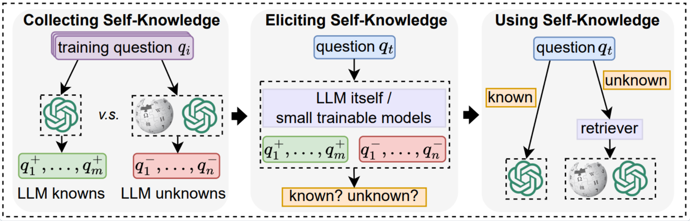
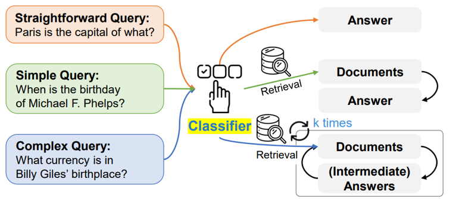

# 判别器

在RAG过程中，并非所有的输入都需要进行检索增强。判别器的作用是对用户给出的query进行分类，为不同类型的query进行不同的检索增强流程。

目前FlashRAG支持两类判别器:

- SKR判别器: 其主要思想是预先标注模型的知识范围,即哪些query是模型本身已知的，哪些是未知的，标注的数据作为训练数据。在推理过程中，使用encoder模型计算用户输入的query与训练数据中最接近的k个query，并通过这些query中已知和未知的比例来判断用户输入的query是否应该进行检索。
具体原理可参考[SKR论文](https://aclanthology.org/2023.findings-emnlp.691.pdf
)。



- Adaptive判别器: 其基于一个训练过的T5模型将给定问题分为三类: 1. 明确的问题, 不需要进行RAG过程，模型可以直接回答；2. 简单问题，需要进行普通的RAG过程；3. 复杂问题，需要进行多轮迭代的RAG过程，反复进行推理和检索。具体原理可参考[Adaptive-RAG论文](https://aclanthology.org/2024.naacl-long.389.pdf)。




## 如何使用判别器

### 配置参数

无论是单独使用判别器或者在`Pipeline`中使用，都需要在`Config`中设置判别器的参数，设置方法如下。

`judger`的配置主要包含两部分, 第一部分是`judger_name`, 第二部分是`judger_config`。

`judger_name`用于识别需要加载的判别器，通常设置为`skr`或者`adaptive`即可。

`judger_config`是字典类型，用于填写不同`judger`的参数。

两种`judger`的配置参数设置可以参考下面的格式和键。

#### Skr judger配置

```yaml
judger_name: skr 
judger_config:
    training_data_path: FlashRAG/examples/methods/sample_data/skr_training.json  # 填写训练数据路径
    model_path: model/sup-simcse-bert-base-uncased  # 填写嵌入模型路径
    topk: 5
    batch_size: 64
    max_length: 128  # 填写嵌入模型的最大长度
```


#### Adaptive judger配置

```yaml
judger_name: adaptive 
judger_config:
    model_path: illuminoplanet/adaptive-rag-classifier  # 填写分类模型路径
    batch_size: 16
    max_length: 512
```

### 加载判别器

配置好参数后，可以直接使用下面的代码进行加载:

```python
from flashrag.utils import get_judger
config = Config('myconfig.yaml')
judger = get_judger(config)
```

### 使用判别器

判别器的使用通过`judge`接口进行调用，其支持下面三种输入类型:
- `flashrag.dataset.Dataset`对象
- `List[str]`: 包含需要判别的query列表
- `str`: 直接输入需要判别的query

使用代码:

```python
output = judger.judge(['who is the president of the united states?'])
# 期望输出: [True]
print(output)
```

- 对于`skr`判别器，判别结果为`True`或者`False`，`True`表示需要进行检索增强，`False`表示不需要进行检索增强。
- 对于`adaptive`判别器，判别结果为`0`, `1`, `2`。其中`0`对应明确的问题，`1`对应简单问题，`2`对应复杂问题。
