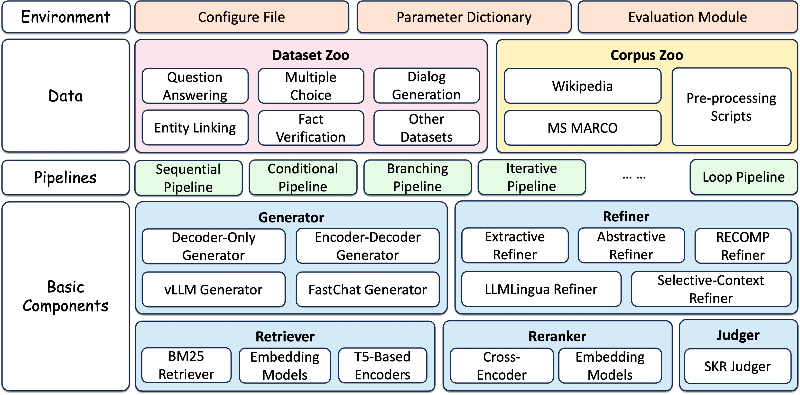

# FlashRAG 简介

## FlashRAG 是什么? 

FlashRAG是一个用于复现和开发检索增强生成（RAG）流程的Python工具包。其集成了RAG流程中需要用到的数据集、文档库、组件实现、算法实现、评估指标以及可视化界面，力求实现更简单、更高效的RAG算法开发与研究。

## FlashRAG能做什么?

- 提供丰富、全面的RAG数据集: 我们集成了36种数据集，覆盖单跳QA、多跳QA、长回答QA、事实核验等RAG场景。所有数据集均已预处理，并托管于HuggingFace和ModelScope双平台，用户可以方便地下载和使用。

- 提供丰富的文档库以及处理脚本: 我们基于维基百科构建了通用的文档库，并提供了预处理脚本来对任意维基百科的文档进行处理。同时我们还提供了丰富的切块脚本，用户可以方便的将自己的文档进行分块，以构建自己的文档库。

- 提供丰富的RAG组件实现: 我们实现了大量RAG过程中可能需要用到的组件，包括检索器、重排序器、生成器、压缩器等。每种组件的接口统一且实现清晰，用户可以直接使用这些组件来构建自己的RAG流程， 也可以基于组件进行二次开发。

- 提供丰富的RAG算法实现: 我们实现了16种RAG算法，用户可以直接对算法进行一键复现，省去自己复现Baseline的繁杂过程。

- 提供用户友好的可视化界面: 我们开发了一个非常易于使用的用户界面，可以轻松快速地配置和体验我们实现的RAG基线，并在可视化界面上运行评估脚本。

## FlashRAG的设计逻辑

FlashRAG基于组件化的思想进行实现，整体包含三个层级: 
- 环境层 (Config)：管理RAG流程中涉及的参数以及运行环境
- 组件层 (Component)：提供丰富的RAG组件实现，包括检索器、重排序器、生成器、压缩器等。
- 算法层 (Pipeline)：提供丰富的RAG算法实现，每种流程是基于不同类型的组件进行实现的。

在使用FlashRAG时，需要先配置环境层(即加载COnfig)，然后再进行组件的选择或者算法的调用。组件和算法的调用均需要基于Config进行。

