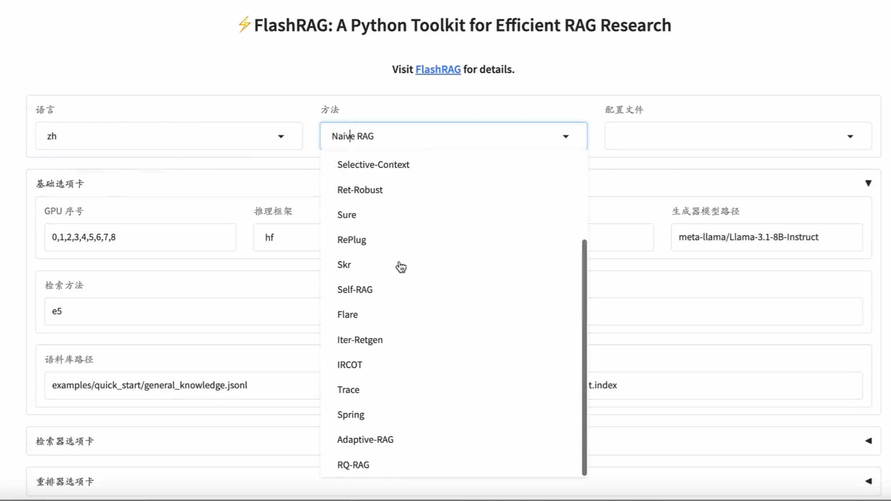
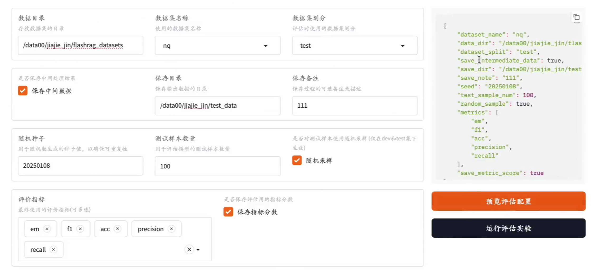

# WebUI

FlashRAG提供了一个WebUI，用户可以通过WebUI界面来体验各类RAG流程以及运行实验，从而免去手动编写代码的繁琐过程。



在安装完成后，通过下面的命令启动WebUI:

```bash
cd FlashRAG/webui
python interface.py
```

WebUI主要包括两种功能: 聊天、评估。

## 配置参数

在执行每种功能前，需要进行参数的配置，需要配置的参数与`Config`中的一致。参数主要分为两部分:

1. 全局参数: 不与某种算法绑定的参数，比如使用的检索器模型、生成器设置等。
2. 算法参数: 与某种算法绑定的参数，仅用于某个对应算法，在算法对应的选项卡中填写。

部分参数配有详细的参数解释，具体含义可以参考`Config`文档。


填写好参数并选择好想使用的算法后，可以点击`保存配置`按钮，配置将会被自动保存到`config`文件夹中的`yaml`文件，下次使用时可以直接加载。

## 聊天

在配置好上面的参数后，可以在聊天界面进行对话。目前仅支持单条query的输入，后续会支持多轮对话。在给出query后，系统会加载对应的`Pipeline`，并打印出算法涉及的各种中间结果。


如果希望修改配置，可以直接在上面的配置界面进行修改，系统会自动在提交query的时候进行动态检查和重加载。


## 评估

评估主要是为了复现算法在某个数据集上的表现。在点击`评估`按钮后，系统会自动加载对应的算法，并在选择的数据集上进行评估。在执行过程中，系统会在下方的控制台打印出算法涉及的各种中间结果，便于用户了解算法执行的过程。




如果设置了保存中间数据，系统会在评估完成后生成一个实验对应的文件夹，并保存中间数据和相关的评测指标结果。
